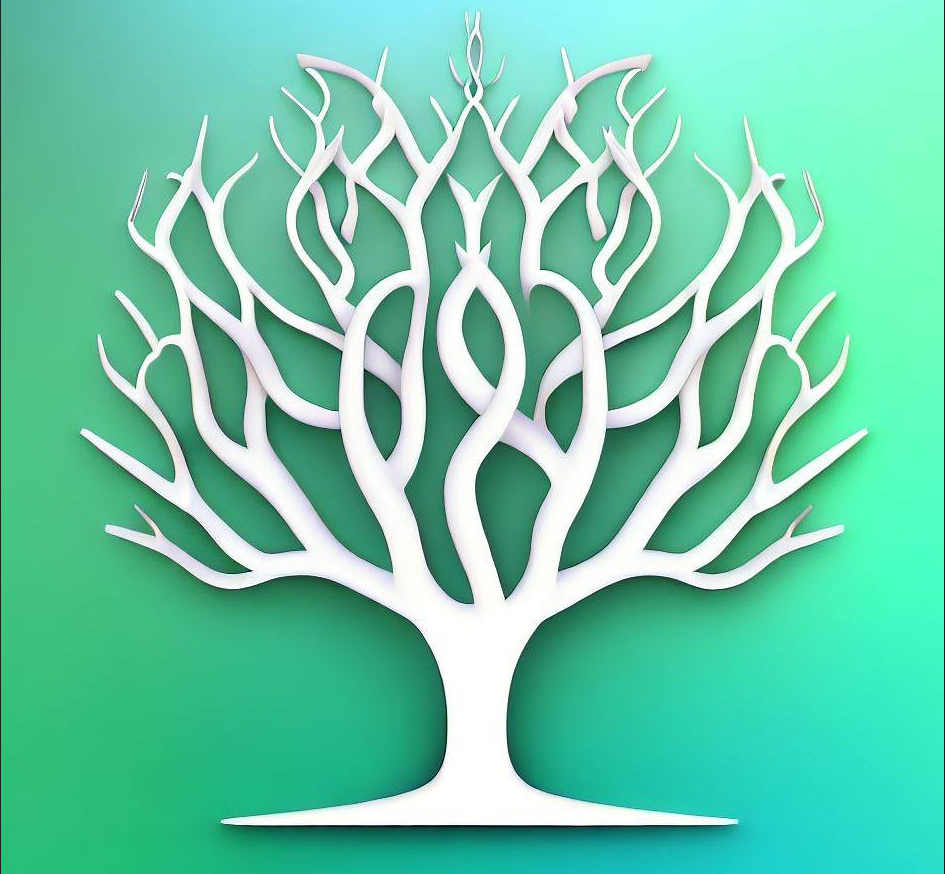

# Blessings Tracker

## An Android/iOS App to aid in remembering things to be grateful for to Allah.

Everyday, we encounter innumerable good things that are given to us by Allah, while we are so used to having them or getting them everyday that we don't even think twice about them and move on with our lives, forgetting about them just as quickly.

This app is thus intended to be used as an aid to our forgetfulness of the good things we get in lives while remembering and highlighting every little misfortune or hardship that befalls us.

While the apps' primary feature is very basic, it is expected that this app will keep receiving new helpful features in the future so that us as Muslims can become a better and more grateful slave of Allah.

## **PLEASE NOTE THAT THIS APP IS EXCLUSIVELY DESIGNED FOR USE BY THE MUSLIM COMMUNITY.**

## Contribution

Contributive PRs are welcome, and asking for new features should also be requested in the "Issues" tab along with any problems encountered while using the application.
